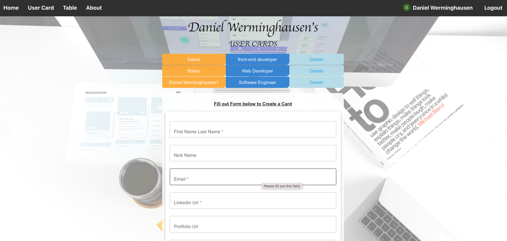
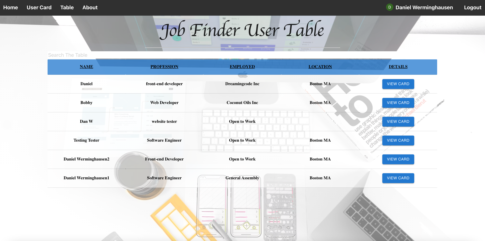

# LinkedUser

A full Crud single page app (SPA) react application. This experimental application is using two different backend. MongoDb to manage data and Firebase to handle users. A user can sign in logging in through google. A user is able to create and manage mutiple user profile cards to be displayed on the User table where all profiles from every user are listed. This application models after Linkedin where possible recruiters can come to the table page and use features such as the search to look for specific candidates. This application is also experimenting using a gify API and a neat light and dark mode feature for one of the forms. The applications main goal is to store data

## Technologies used

- HTML5
- CSS3
- JavaScript
- Node.js
- Express
- MongoDB
- Firebase
- Google Auth
- react
- Jsx
- <a href="heroku.com/">Heroku</a>

## Screenshots

- "Welcome Page View" 
  
- "UserCard page" 
  
- "User Table" 
  

## Getting Started

- A User must login in order to get access to the UserCard tab and the table. Users will be able to manage
  create update and delete thier profile cards
- All users who are signed in also have access to the table page where all user cards are nicely displayed for example recruiters to check out  
- Welcome to a small replica of LinkedIn  
  https://linked-user.netlify.app/

## Future Enhancements

- make site mobil friendly
- add admin features/login
